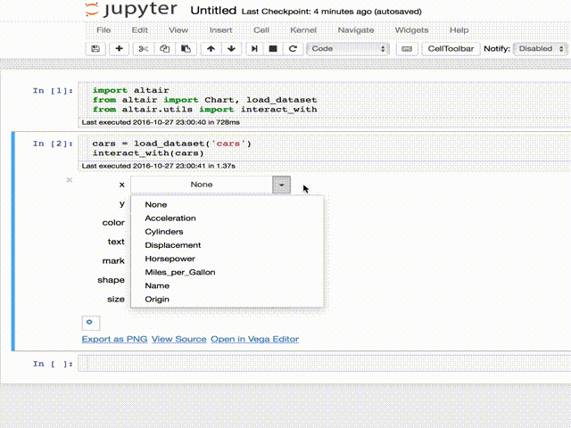

# Altair Widgets

Altair Widgets are a tool to easily allow to interact with Altair graphs in the
Jupyter notebook.

UW-Data is also working on [Voyager], and have an alpha [online demo] that can
be used with any data.

[Voyager]:https://github.com/vega/voyager
[online demo]:https://uwdata.github.io/voyager2/
