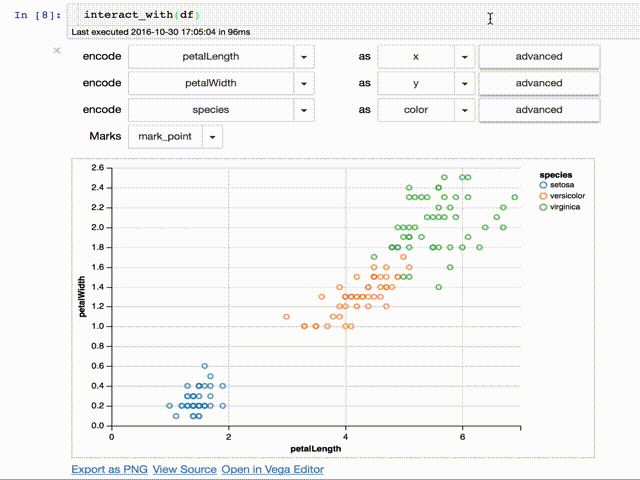
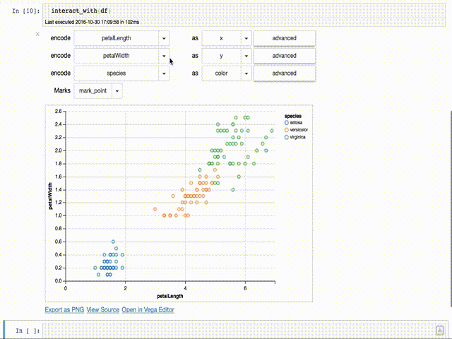

# Altair Widgets


Altair Widgets are a tool to easily allow to interact with Altair charts in the
Jupyter notebook.



This tool allows interactive exploration:



This library depends on [Altair] which relies on [Vega-Lite] for rendering
charts.  On Vega's homepage they list some other interactive toolkits.  One of
these is [Voyager] which has an [online app] that can be used with any CSV
data.

# Install

With conda:

``` bash
$ conda install -c conda-forge ipywidgets
$ conda install -c conda-forge altair
$ pip install altair_widgets
```

With pip:

``` bash
$ pip install altair_widgets
$ jupyter nbextension enable --py --sys-prefix widgetsnbextension
$ jupyter nbextension enable --py --sys-prefix vega
```


[Altair]:https://altair-viz.github.io
[vega-lite]:https://vega.github.io
[modrian-rest-ui]:https://github.com/jazzido/mondrian-rest-ui
[Voyager]:https://github.com/vega/voyager
[online app]:https://uwdata.github.io/voyager2/
